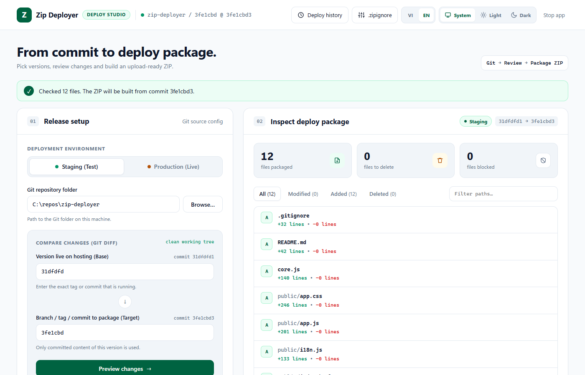

<div align="center">
  <h1>Zip Deployer</h1>
  <p><em>Từ commit đến gói deploy.</em></p>
  <p>
    
    
    
    
    <a href="https://github.com/toantran46/zip-deployer/stargazers"></a>
  </p>
  <sub><a href="README.md">English</a> · Tiếng Việt</sub>
</div>

<br>

<picture>
  <source media="(prefers-color-scheme: dark)" srcset="docs/images/screenshot-dark.png">
  
</picture>

Zip Deployer chỉ đóng gói những file thay đổi giữa hai Git ref thành một file ZIP để upload lên hosting không có CI, ví dụ shared hosting qua cPanel hoặc FTP. App chạy trên máy Windows của bạn, đọc nội dung file trực tiếp từ Git và kiểm tra lại từng file trong ZIP trước khi bạn upload.

## Cách hoạt động

1. **Git.** Bạn chọn phiên bản đang chạy trên hosting (Base) và phiên bản cần đưa lên (Target). App so sánh hai commit.
2. **Kiểm tra.** Mỗi đường dẫn thay đổi được đối chiếu với quy tắc an toàn và `.zipignore` của bạn. Bạn thấy file thêm mới, chỉnh sửa, đã xóa cùng số dòng trước khi tạo gói.
3. **Đóng gói.** Nội dung file lấy từ Git blob của commit Target, nên file chưa commit hay commit mới hơn không lọt vào.
4. **Xác minh.** App đọc lại ZIP và so SHA-256, kích thước của từng file với commit. Chỉ cần lệch một file là lần đóng gói thất bại.

## Bắt đầu nhanh

Yêu cầu: Windows, Node.js 18 trở lên, Git và Windows PowerShell có trong `PATH`. Không cần `npm install`.

1. Nhấp đúp `start.cmd`. App chạy ẩn trên `127.0.0.1` với một cổng trống và mở trình duyệt.
2. Bấm **Dừng app** khi xong việc. Đóng tab không dừng server; chạy lại `start.cmd` sẽ mở lại phiên đang chạy.

Giao diện mặc định là tiếng Anh. Thanh trên cùng có nút chuyển ngôn ngữ **VI | EN** và nút giao diện **Hệ thống | Sáng | Tối** (Hệ thống theo cài đặt của Windows). Cả hai lựa chọn được trình duyệt ghi nhớ.

## Cách dùng

1. Chọn **Staging (Thử nghiệm)** hoặc **Production (Trực tiếp)**. Production hiện banner cảnh báo màu hổ phách.
2. Chọn repository: nhập đường dẫn, hoặc bấm **Chọn thư mục…** để mở hộp chọn thư mục của Windows.
3. Điền **Base** (tag hoặc commit đang chạy trên hosting) và **Target** (branch, tag hoặc commit cần đưa lên). Khi gõ, cả hai ô gợi ý branch local, branch remote và tag, nên gõ `release/` sẽ liệt kê mọi branch release. Ref phải có sẵn ở máy; app không tự fetch. Với production, nhập thêm tag mới.
4. Bấm **Xem trước thay đổi**. Xem các con số, rồi danh sách file: các tab **Tất cả / Chỉnh sửa / Thêm mới / Đã xóa** dùng để lọc, và mỗi file hiện số dòng thêm, bớt. File bị chặn hiện phía trên danh sách; file đã xóa phải được xác nhận trước khi đóng gói.
5. Bấm **Tạo ZIP**, rồi **Mở thư mục kết quả**, và upload file ZIP vào thư mục gốc của hosting theo quy trình của bạn. Đường dẫn trong ZIP tính từ gốc repository. Hãy sao lưu hosting trước khi thay file.
6. Tùy chọn cho production: mở **Tạo & push tag production**, xác nhận rồi bấm nút. Công cụ không bao giờ ghi đè tag và chỉ push đúng tag đó lên `origin`, dùng thông tin đăng nhập Git sẵn có của bạn.

## Kết quả

Mỗi lần đóng gói có một thư mục riêng trong `output/`, đặt tên `{môi trường}-{nhãn}-{YYYYMMDD-HHmm}` theo giờ máy, ví dụ `output/prod-1.44.0-20260929-1430/` hoặc `output/staging-release-1.44.0-rc-20260929-1015/`. Nhãn là tag production, hoặc Target với staging, cắt còn 40 ký tự để tránh giới hạn độ dài đường dẫn của Windows (tên file ZIP vẫn giữ nguyên). Nếu tên đã có, app thêm `-2`, `-3`…, nên bản đóng gói cũ không bao giờ bị ghi đè.

| File | Nội dung |
|---|---|
| `deploy-*.zip` | File cần upload. Không có thư mục bọc ngoài; mọi đường dẫn dùng `/`. |
| `deploy-files.txt` | Các file có trong ZIP. |
| `deleted-files.txt` | Đường dẫn cần tự kiểm tra hoặc xóa trên hosting, gồm cả đường dẫn cũ của file đổi tên. |
| `manifest.json` | Commit Base và Target, SHA-256 và kích thước từng file. |
| `verification.json` | Mã băm đọc lại từ ZIP. |
| `files/` | Nội dung trung gian lấy từ Git. |

Có thể xóa cả thư mục sau khi upload.

## Lịch sử deploy

**Lịch sử deploy** liệt kê 50 bản đóng gói gần nhất từ `output/*/manifest.json`: môi trường, tag hoặc Target, khoảng commit, số file, kích thước ZIP và thời gian. **Mở thư mục** mở bản đóng gói đó trong Explorer. Xóa một thư mục trong `output/` sẽ xóa nó khỏi lịch sử. Thư mục không đọc được manifest sẽ bị bỏ qua, còn bản đóng gói từ phiên bản cũ có tên thư mục ngẫu nhiên vẫn hiện.

## .zipignore

Commit file `.zipignore` ở gốc repository để loại thêm đường dẫn khỏi ZIP. File được đọc từ **commit Target**, không phải thư mục làm việc, nên sửa mà chưa commit sẽ không có tác dụng. Nút **.zipignore** trên thanh trên cùng hiện các loại trừ tích hợp sẵn và quy tắc đọc được ở lần xem trước gần nhất.

- Mỗi dòng một mẫu, tính từ gốc repository, không phân biệt hoa thường. Một mẫu khớp một file hoặc cả thư mục (`build` và `/build/` đều loại `build/…`).
- `*` khớp trong một cấp thư mục, `**` khớp qua nhiều cấp (`assets/*.map`, `**/*.log`).
- Dòng trống và dòng bắt đầu bằng `#` bị bỏ qua. Dòng bắt đầu bằng `!` được hiển thị nhưng không có tác dụng: `.zipignore` chỉ thêm loại trừ.
- Đường dẫn khớp được liệt kê là không đóng gói trong phần xem trước, và bản thân `.zipignore` không bao giờ được đóng gói.

## Quy tắc an toàn

App chặn `wp-config.php`, `.env*`, uploads, cccd, `error_log`, file SQL và ZIP, khóa riêng, symlink, submodule và đường dẫn không an toàn trên Windows. Các thư mục gốc `docs`, `tools`, `tests`, `.agents`, `.claude`, `.codex`, `.github`, `node_modules`, `.deploy-temp` và file hướng dẫn cho agent được liệt kê riêng là không đóng gói. Quy tắc dựa trên đường dẫn: **đây không phải công cụ quét bí mật trong nội dung file.** Muốn đóng gói một đường dẫn bị chặn, hãy chủ động sửa chính sách trong `core.js`.

Giải nén ZIP không xóa file, không chạy migration, không cập nhật database WordPress và không xóa cache. Khi thay đổi chỉ gồm file bị xóa, app liệt kê chúng và không tạo ZIP rỗng. ZIP tạo thành công mới là gói deploy, chưa phải deploy xong.

## Bảo mật

Server chỉ lắng nghe trên loopback và kiểm tra Host, Origin cùng token theo phiên ở mọi lệnh API. Đừng mở cổng này ra mạng hoặc đặt thư mục công cụ lên hosting. Không có gì được đăng ký tự chạy cùng Windows.

## Phát triển

```bash
node --test test.js
```

Test dùng repository tạm và một remote bare cục bộ, không bao giờ đụng đến tag, remote hay `output/` của dự án.

```bash
node server.js --repo C:\path\to\repo --open
```

Chạy server trong terminal và in URL. `--repo` điền sẵn ô repository, `--open` mở trình duyệt.

| File | Vai trò |
|---|---|
| `core.js` | Làm việc với Git, chính sách đường dẫn, `.zipignore`, đóng gói và lịch sử |
| `server.js` | HTTP API trên loopback và file tĩnh |
| `public/` | Giao diện (`index.html`, `app.css`, `app.js`) và chuỗi tiếng Anh (`i18n.js`) |
| `zip.ps1` | Tạo ZIP và đọc lại mã băm từng file |
| `pick-folder.ps1` | Hộp "Select folder" của Windows cho nút **Chọn thư mục…** |
| `start.cmd`, `start.ps1` | Trình khởi chạy ẩn, dùng lại phiên đang chạy |
| `test.js` | Bộ test `node:test` |

## Câu hỏi thường gặp

**Sao thay đổi chưa commit không có trong ZIP?**
Nội dung được đọc từ Git blob của commit Target. Hãy commit rồi xem trước lại.

**App có upload hay deploy không?**
Không. App tạo và xác minh gói; bạn tự upload và giải nén theo quy trình của mình.

**File đã xóa thì sao?**
Chúng hiện ở tab **Đã xóa** và trong `deleted-files.txt`, và bạn phải xác nhận trước khi đóng gói. Hãy tự xóa chúng trên hosting.

**Sao một file bị chặn?**
Đường dẫn của nó khớp một [quy tắc an toàn](#quy-tắc-an-toàn). Thu hẹp khoảng commit, hoặc chủ động sửa chính sách trong `core.js`.

**Sao chỉ chạy trên Windows?**
App dùng Windows PowerShell để tạo và xác minh ZIP, Explorer để mở thư mục và hộp chọn thư mục của Windows cho nút **Chọn thư mục…**.

**Branch của tôi không được gợi ý, hoặc xem trước báo không tìm thấy.**
Ref phải có sẵn ở máy. Chạy `git fetch` trong repository, rồi chọn lại repository để nạp lại gợi ý.

**"Tag đã tồn tại và trỏ đến commit khác."**
Công cụ không bao giờ dời hay ghi đè tag. Hãy chọn tag mới.

**Dọn dẹp thế nào?**
Xóa các thư mục trong `output/`. Chúng sẽ biến mất khỏi Lịch sử deploy.

## Giấy phép

[MIT](LICENSE) © 2026 Trần Trọng Toàn

## Lịch sử sao

<a href="https://www.star-history.com/#toantran46/zip-deployer&Date">
  <picture>
    <source media="(prefers-color-scheme: dark)" srcset="https://api.star-history.com/svg?repos=toantran46/zip-deployer&type=Date&theme=dark">
    <source media="(prefers-color-scheme: light)" srcset="https://api.star-history.com/svg?repos=toantran46/zip-deployer&type=Date">
    
  </picture>
</a>
